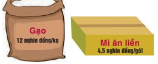
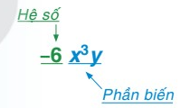
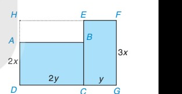

<!-- SECTION: QUICK_NOTES -->

<strong>💡 Định Nghĩa Cô Đọng:</strong> 
• <strong>Đơn thức</strong> là biểu thức đại số chỉ gồm một số, một biến, hoặc tích giữa các số và các biến. 
• <strong>Đơn thức thu gọn</strong> là đơn thức mà mỗi biến chỉ xuất hiện 1 lần dưới dạng luỹ thừa với số mũ nguyên dương.

#### 📐 Công Thức Trọng Tâm:

• <strong>Dạng chuẩn đơn thức thu gọn:</strong> $$A = a \cdot x^m y^n z^p \quad (a \ne 0)$$
  - $a$ là <strong>hệ số</strong>, $x^m y^n z^p$ là <strong>phần biến</strong>. 
• <strong>Bậc của đơn thức:</strong> $$\text{Bậc} = m + n + p \quad \text{(Tổng số mũ của tất cả các biến)}$$
• <strong>Cộng / trừ đơn thức đồng dạng:</strong> (cùng phần biến, hệ số $\ne 0$)
  $$a \cdot X \pm b \cdot X = (a \pm b) \cdot X$$
  <em>(Cộng/trừ phần hệ số, GIỮ NGUYÊN phần biến)</em>

<strong>⚠️ Sai Lầm Thường Gặp Cần Tránh:</strong> 
❌ <strong>Lỗi 1:</strong> Chưa thu gọn đơn thức đã vội kết luận bậc. <em>(Ví dụ: $2x \cdot 3x^2$ có bậc $1 + 2 = 3$, không được nói là bậc 1).</em> 
❌ <strong>Lỗi 2:</strong> Nhầm số $0$ có bậc $0$. <em>Ghi nhớ: Số thực khác $0$ có bậc $0$; còn riêng số $0$ thì <strong>không có bậc</strong>!</em> 
❌ <strong>Lỗi 3:</strong> Khi cộng đơn thức đồng dạng lại cộng luôn cả số mũ: $2x^2 + 3x^2 = 5x^4$ (SAI) ➔ Đúng phải là: $5x^2$.

<!-- SECTION: STEP_EXAMPLES -->
### 📝 Ví Dụ Mẫu Biến Đổi Từng Bước

#### 📌 Ví dụ 1: Thu gọn đơn thức và xác định hệ số, phần biến, bậc
Cho đơn thức: $$M = -2x^2y \cdot \frac{3}{4}xy^3$$
Hãy thu gọn $M$, sau đó chỉ rõ hệ số, phần biến và bậc.

<strong>🔍 Phương pháp tư duy:</strong> Nhóm các hệ số số học nhân với nhau, nhóm các biến cùng tên nhân với nhau rồi áp dụng quy tắc $x^m \cdot x^n = x^{m+n}$.  
<strong>📝 Lời giải chi tiết:</strong> 
• <strong>Bước 1 (Nhóm phần số và phần biến):</strong>
  $$M = \left(-2 \cdot \frac{3}{4}\right) \cdot (x^2 \cdot x) \cdot (y \cdot y^3)$$
• <strong>Bước 2 (Thực hiện nhân luỹ thừa):</strong>
  $$M = -\frac{3}{2}x^{2+1}y^{1+3} = -\frac{3}{2}x^3y^4$$
• <strong>Kết luận:</strong>
  - Hệ số: <strong>$-\frac{3}{2}$</strong> 
  - Phần biến: <strong>$x^3y^4$</strong> 
  - Bậc của đơn thức: $3 + 4 =$ <strong>$7$</strong>

#### 📌 Ví dụ 2: Cộng trừ các đơn thức đồng dạng
Thu gọn biểu thức: $$P = 4x^2y^3 - 7x^2y^3 + 2x^2y^3$$

<strong>🔍 Phương pháp tư duy:</strong> Kiểm tra phần biến thấy đều là $x^2y^3$ (đồng dạng). Ta chỉ cần cộng trừ các hệ số và giữ nguyên phần biến.  
<strong>📝 Lời giải chi tiết:</strong> 
• <strong>Bước 1 (Đặt nhân tử chung là phần biến):</strong>
  $$P = (4 - 7 + 2)x^2y^3$$
• <strong>Bước 2 (Tính toán hệ số):</strong>
  $$4 - 7 + 2 = -1 \implies P = -1x^2y^3 = -x^2y^3$$
• <strong>Kết luận:</strong> Biểu thức thu gọn là <strong>$-x^2y^3$</strong>.

<!-- SECTION: SGK_CONTENT -->
# CHƯƠNG I. ĐA THỨC

> *Ở lớp 7, các em đã học về đa thức một biến. Khái niệm và các phép toán đối với đa thức nhiều biến cũng tương tự như đa thức một biến. Tuy nhiên, hai chữ "nhiều biến" chắc chắn sẽ đem lại những sự khác biệt nhất định. Học chương này, các em hãy để ý xem giữa đa thức nhiều biến và đa thức một biến có những gì giống và khác nhau nhé.*

---

# BÀI 1. ĐƠN THỨC

| Khái niệm, thuật ngữ | Kiến thức, kĩ năng |
|---|---|
| - Đơn thức - Hệ số, phần biến (của đơn thức) - Bậc (của đơn thức) - Đơn thức đồng dạng | - Nhận biết đơn thức, đơn thức thu gọn, hệ số, phần biến và bậc của đơn thức. - Thu gọn đơn thức. - Nhận biết đơn thức đồng dạng. - Cộng và trừ hai đơn thức đồng dạng. |

---

## Tình huống mở đầu

Một nhóm thiện nguyện chuẩn bị $y$ phần quà giúp đỡ những gia đình có hoàn cảnh khó khăn. Mỗi phần quà gồm $x\text{ kg}$ gạo và $x$ gói mì ăn liền. Viết biểu thức biểu thị giá trị bằng tiền (nghìn đồng) của toàn bộ số quà đó.

Hai bạn Tròn và Vuông lập luận như sau:

- **Tròn:** Tổng số gạo trong $y$ phần quà trị giá $12xy$ (nghìn đồng); tổng số gói mì ăn liền trong $y$ phần quà trị giá $4,5xy$ (nghìn đồng). Vậy biểu thức cần tìm là $12xy + 4,5xy$.
- **Vuông:** Mỗi phần quà trị giá $12x + 4,5x = 16,5x$ (nghìn đồng). Do đó, $y$ phần quà trị giá $16,5xy$ (nghìn đồng). Vậy biểu thức cần tìm là $16,5xy$.

*Theo em, bạn nào giải đúng?*

---

## 1. Đơn thức và đơn thức thu gọn

### Khái niệm đơn thức

**HĐ1:** Biểu thức $x^2 - 2x$ có phải là đơn thức một biến không? Vì sao? Hãy cho một vài ví dụ về đơn thức một biến.

**HĐ2:** Xét các biểu thức đại số:
$$-5x^2y;\quad x^3 - \frac{1}{2}x;\quad 17z^4;\quad -\frac{1}{5}y^2 5;\quad -2x + 7y;\quad xy4x^2;\quad x + 2y - z.$$

Hãy sắp xếp các biểu thức đó thành hai nhóm:
- *Nhóm 1:* Những biểu thức có chứa phép cộng hoặc phép trừ.
- *Nhóm 2:* Các biểu thức còn lại.

Nếu hiểu đơn thức (nhiều biến) tương tự đơn thức một biến thì theo em, nhóm nào trong hai nhóm trên bao gồm những đơn thức?

> [!NOTE]
> **Đơn thức** là biểu thức đại số chỉ gồm một số hoặc một biến, hoặc có dạng tích của những số và biến.

**Ví dụ 1:**
Tìm đơn thức trong các biểu thức sau:
$$-x6y;\quad x + 2y;\quad 0,3xyx^2;\quad 5x\sqrt{y}.$$

*(Gợi ý: Một luỹ thừa cũng là một tích đấy nhé!)*

**Giải:**
Biểu thức $x + 2y$ không là đơn thức vì có chứa phép cộng. Biểu thức $5x\sqrt{y}$ không là đơn thức vì có chứa căn bậc hai của biến. Hai biểu thức còn lại đều là đơn thức.

**Luyện tập 1:**
Trong các biểu thức sau đây, biểu thức nào là đơn thức?
$$3x^3y;\quad -4;\quad (3 - x)x^2y^2;\quad 12x^5;\quad -\frac{5}{9}xyz;\quad \frac{x^2y}{2};\quad \frac{3}{x} + y^2.$$

**Tranh luận:**
- **Pi:** "Biểu thức $(1 + \sqrt{2})x^2y$ có phải là đơn thức không?"
- **Tròn:** "Mình nghĩ là đúng, đó là một đơn thức."
- **Vuông:** "Mình nghĩ là không phải, bởi vì trong đó có phép cộng."
*Còn em nghĩ sao?*

---

### Đơn thức thu gọn, bậc của một đơn thức

1. Quan sát hai đơn thức $A = 2xy(-3)x^2$ và $B = 5x^2y^3z$, ta thấy: Trong đơn thức $A$ có hai số ($2$ và $-3$), và biến $x$ xuất hiện hai lần. Trái lại, trong đơn thức $B$ chỉ có một số và mỗi biến chỉ xuất hiện một lần (dưới dạng một luỹ thừa). Ta gọi các đơn thức như $B$ là các *đơn thức thu gọn*.

> [!NOTE]
> **Đơn thức thu gọn** là đơn thức chỉ gồm một số, hoặc có dạng tích của một số với những biến, mỗi biến chỉ xuất hiện một lần và đã được nâng lên luỹ thừa với số mũ nguyên dương.

2. Với các đơn thức chưa là đơn thức thu gọn, ta có thể thu gọn chúng bằng cách áp dụng các tính chất của phép nhân và phép nâng lên luỹ thừa. Ví dụ, với đơn thức $A$ ta làm như sau:
   $$A = 2xy(-3)x^2 = 2 \cdot (-3) \cdot (x \cdot x^2) \cdot y = -6 \cdot x^3 \cdot y = -6x^3y.$$

3. **Bậc của đơn thức:**
   *Tổng số mũ của các biến trong một đơn thức thu gọn với hệ số khác 0 gọi là **bậc** của đơn thức đó.*
   Chẳng hạn, trong đơn thức $B$, tổng các số mũ của $x, y$ và $z$ là $2 + 3 + 1 = 6$ nên $B$ có bậc là $6$.
   Để xác định bậc của một đơn thức chưa thu gọn, ta nên thu gọn đơn thức đó. Chẳng hạn, đơn thức thu gọn của $A$ là đơn thức $-6x^3y$. Đơn thức này có bậc là $4$ nên đơn thức $A$ có bậc là $4$.

4. Trong một đơn thức thu gọn, phần số còn gọi là **hệ số**, phần còn lại gọi là **phần biến**.
   Ví dụ, đơn thức $-6x^3y$ có hệ số là $-6$, phần biến là $x^3y$.

   

> [!TIP]
> **Chú ý:**
> - Với các đơn thức có hệ số là $+1$ hay $-1$, ta không viết số 1. Ví dụ, đơn thức $xy^2$ có hệ số là $1$; đơn thức $-x^2y^2$ có hệ số là $-1$.
> - Mỗi số khác 0 là một đơn thức thu gọn bậc 0.
> - Số 0 cũng được coi là một đơn thức. Nó không có bậc.
> - Khi viết một đơn thức thu gọn, ta thường viết hệ số trước, phần biến sau; các biến viết theo thứ tự trong bảng chữ cái.

**Câu hỏi (?):**
Cho biết hệ số, phần biến và bậc của mỗi đơn thức sau:
$$2,5x;\quad -\frac{1}{4}y^2z^3;\quad 0,35xy^2z^4.$$

**Ví dụ 2:**
Xác định hệ số, phần biến và bậc của đơn thức $0,5xy^2 4x^2$.

**Giải:**
Trước hết ta thu gọn đơn thức đã cho:
$$0,5xy^2 4x^2 = (0,5 \cdot 4)(x \cdot x^2)y^2 = 2x^3y^2.$$
Vậy hệ số của đơn thức là $2$, phần biến là $x^3y^2$ và bậc là $5$.

**Luyện tập 2:**
Thu gọn và xác định bậc của đơn thức $4,5x^2y(-2)xyz$.

---

## 2. Đơn thức đồng dạng

Từ đây, khi nói đến một đơn thức, ta hiểu rằng *đơn thức đó đã được thu gọn*.

### Khái niệm đơn thức đồng dạng

**HĐ3:** Cho đơn thức một biến $M = 3x^2$. Hãy viết ba đơn thức biến $x$, cùng bậc với $M$ rồi so sánh phần biến của các đơn thức đó.

**HĐ4:** Xét ba đơn thức $A = 2x^2y^3$, $B = -\frac{1}{2}x^2y^3$ và $C = x^3y^2$. So sánh:
a) Bậc của ba đơn thức $A, B$ và $C$;
b) Phần biến của ba đơn thức $A, B$ và $C$.

Ta gọi hai đơn thức $A$ và $B$ như trên là hai *đơn thức đồng dạng*. Một cách tổng quát:

> [!NOTE]
> **Hai đơn thức đồng dạng** là hai đơn thức với hệ số khác 0 và có phần biến giống nhau.

**Nhận xét:** Hai đơn thức đồng dạng thì có cùng bậc.

**Luyện tập 3:**
Cho các đơn thức:
$$\frac{5}{3}x^2y;\quad -xy^2;\quad 0,5x^4;\quad -2xy^2;\quad 2,75x^4;\quad -\frac{1}{4}x^2y;\quad 3xy^2.$$

Hãy sắp xếp các đơn thức đã cho thành từng nhóm, sao cho tất cả các đơn thức đồng dạng thì thuộc cùng một nhóm.

**Tranh luận:**
- **Vuông:** "Ta đã biết nếu hai đơn thức một biến có cùng biến và có cùng bậc thì đồng dạng với nhau. Hỏi điều đó có còn đúng không đối với hai đơn thức hai biến (nhiều hơn một biến)?"
- **Tròn:** "Hãy xem lại HĐ3 và HĐ4."

---

### Cộng và trừ đơn thức đồng dạng

**HĐ5:** Quan sát ví dụ sau:
$$2,5 \cdot 3^2 \cdot 5^3 + 8,5 \cdot 3^2 \cdot 5^3 = (2,5 + 8,5) \cdot 3^2 \cdot 5^3 = 11 \cdot 3^2 \cdot 5^3.$$
Trong ví dụ này, ta đã vận dụng tính chất gì của phép nhân để thu gọn tổng ban đầu?

**HĐ6:** Cho hai đơn thức đồng dạng $M = 2,5x^2y^3$ và $P = 8,5x^2y^3$. Tương tự HĐ5, hãy:
a) Thu gọn tổng $M + P$;
b) Thu gọn hiệu $M - P$.

Ta rút ra quy tắc cộng (trừ) các đơn thức đồng dạng như sau:

> [!NOTE]
> **Quy tắc:** Muốn cộng (hay trừ) các đơn thức đồng dạng, ta cộng (hay trừ) các hệ số với nhau và giữ nguyên phần biến.

**Ví dụ 3:**
Cho các đơn thức $A = 3xy^2$; $B = -5xy^2$ và $C = xy^2$ là ba đơn thức đồng dạng.
Tính $A + B$; $A - B$; $A + B + C$.

**Giải:**
$$A + B = [3 + (-5)]xy^2 = -2xy^2;$$
$$A - B = [3 - (-5)]xy^2 = 8xy^2;$$
$$A + B + C = (3 - 5 + 1)xy^2 = -xy^2.$$

**Luyện tập 4:**
Cho các đơn thức $-x^3y$; $4x^3y$ và $-2x^3y$.
a) Tính tổng $S$ của ba đơn thức đó.
b) Tính giá trị của tổng $S$ tại $x = 2; y = -3$.

**Vận dụng:**
Trở lại các lập luận của Tròn và Vuông trong *tình huống mở đầu*. Hãy trả lời và giải thích rõ tại sao.

---

## BÀI TẬP

**1.1.** Trong các biểu thức sau, biểu thức nào là đơn thức?
$$-x;\quad (1 + x)y^2;\quad (3 + \sqrt{3})xy;\quad 0;\quad \frac{1}{y}x^2;\quad 2\sqrt{xy}.$$

**1.2.** Cho các đơn thức:
$$A = 4x(-2)x^2y;\quad B = 12,75xyz;\quad C = (1 + 2 \cdot 4,5)x^2y\frac{1}{5}y^3;\quad D = (2 - \sqrt{5})x.$$
a) Liệt kê các đơn thức thu gọn trong các đơn thức đã cho và thu gọn các đơn thức còn lại.
b) Với mỗi đơn thức nhận được, hãy cho biết hệ số, phần biến và bậc của nó.

**1.3.** Thu gọn rồi tính giá trị của mỗi đơn thức sau:
a) $A = (-2)x^2y\frac{1}{2}xy$ khi $x = -2; y = \frac{1}{2}$.
b) $B = xyz(-0,5)y^2z$ khi $x = 4; y = 0,5; z = 2$.

**1.4.** Sắp xếp các đơn thức sau thành từng nhóm, mỗi nhóm chứa tất cả các đơn thức đồng dạng với nhau:
$$3x^3y^2;\quad -0,2x^2y^3;\quad 7x^3y^2;\quad -4y;\quad \frac{3}{4}x^2y^3;\quad y\sqrt{2}.$$

**1.5.** Rút gọn rồi tính giá trị của biểu thức:
$$S = \frac{1}{2}x^2y^5 - \frac{5}{2}x^2y^5 \quad \text{khi } x = -2 \text{ và } y = 1.$$

**1.6.** Tính tổng của bốn đơn thức:
$$2x^2y^3;\quad -\frac{3}{5}x^2y^3;\quad -14x^2y^3;\quad \frac{8}{5}x^2y^3.$$

**1.7.** Một mảnh đất có dạng như phần được tô màu xanh trong hình bên cùng với các kích thước được ghi trên đó. Hãy tìm đơn thức (thu gọn) với hai biến $x$ và $y$ biểu thị diện tích của mảnh đất đã cho bằng hai cách:
- *Cách 1.* Tính tổng diện tích của hai hình chữ nhật $ABCD$ và $EFGC$.
- *Cách 2.* Lấy diện tích của hình chữ nhật $HFGD$ trừ đi diện tích của hình chữ nhật $HEBA$.

