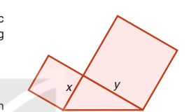

# BÀI 2. ĐA THỨC

| Khái niệm, thuật ngữ | Kiến thức, kĩ năng |
|---|---|
| - Đa thức, đa thức thu gọn - Hạng tử (của đa thức) - Bậc (của đa thức) | - Nhận biết các khái niệm: đa thức, hạng tử của đa thức, đa thức thu gọn và bậc của đa thức. - Thu gọn đa thức. - Tính giá trị của đa thức khi biết giá trị của các biến. |

---

## Tình huống mở đầu

Biểu thức biểu thị diện tích của hình tạo bởi một tam giác vuông và hai hình vuông dựng trên hai cạnh góc vuông của nó (Hình 1.1) là:
$$x^2 + y^2 + \frac{1}{2}xy.$$

Đó là một ví dụ về đa thức (hai biến). Trong bài này chúng ta sẽ tìm hiểu những khái niệm ban đầu về đa thức nhiều biến (gọi đơn giản là *đa thức*), trong đó đa thức một biến đã học chỉ là trường hợp riêng.

---

## 1. Khái niệm đa thức

### Đa thức và các hạng tử của đa thức

**HĐ1:** Hãy nhớ lại, đa thức một biến là gì? Nêu một ví dụ về đa thức một biến.

**HĐ2:** Em hãy viết ra hai *đơn thức* tuỳ ý (không chứa biến, hoặc chứa từ một đến ba biến trong các biến $x, y, z$) rồi trao đổi với bạn ngồi cạnh để kiểm tra lại xem đã viết đúng chưa. Nếu chưa đúng, hãy cùng bạn sửa lại cho đúng.

**HĐ3:** Viết tổng của bốn đơn thức mà em và bạn ngồi cạnh đã viết.

Biểu thức em vừa viết cũng là một ví dụ về *đa thức*. Một cách tổng quát:

> [!NOTE]
> **Đa thức** là tổng của những đơn thức; mỗi đơn thức trong tổng gọi là một **hạng tử** của đa thức đó.

**Chú ý:** Mỗi đơn thức cũng được coi là một đa thức.

**Ví dụ 1:**
Hãy kể ra các hạng tử của đa thức $A = x^3 - 3x^2y + 3xy^2 - y^3 + xy - 1$.

**Giải:**
Ta có thể viết $A$ dưới dạng tổng của 6 đơn thức:
$$A = x^3 + (-3x^2y) + 3xy^2 + (-y^3) + xy + (-1).$$
Vậy đa thức $A$ có 6 hạng tử là $x^3, -3x^2y, 3xy^2, -y^3, xy$ và $-1$.

**Luyện tập 1:**
Biểu thức nào dưới đây là đa thức? Hãy chỉ rõ các hạng tử của mỗi đa thức ấy.
$$3xy^2 - 1;\quad x + \frac{1}{x};\quad \sqrt{2}\ x + \sqrt{3}\ y;\quad x + \sqrt{xy} + y.$$

*(Để đơn giản, trong bài này ta chỉ kí hiệu các biến là $x, y$ và $z$.)*

**Vận dụng:**
Mỗi quyển vở giá $x$ đồng. Mỗi cái bút giá $y$ đồng. Viết biểu thức biểu thị số tiền phải trả để mua:
a) 8 quyển vở và 7 cái bút.
b) 3 xấp vở và 2 hộp bút, biết rằng mỗi xấp vở có 10 quyển, mỗi hộp bút có 12 chiếc.
c) Mỗi biểu thức tìm được ở hai câu trên có phải là đa thức không?

---

## 2. Đa thức thu gọn

### Đa thức thu gọn. Thu gọn một đa thức

1. Xét đa thức $B = 2x^2 - 3xy + x^2 - 3y^2 + 5xy$. Trong đa thức $B$, ta thấy có hai hạng tử $2x^2$ và $x^2$ là những *đơn thức đồng dạng* (còn gọi là những *hạng tử đồng dạng*). Tương tự, hai hạng tử $-3xy$ và $5xy$ cũng đồng dạng với nhau.
Trái lại, trong đa thức $A = x^3 - 3x^2y + 3xy^2 - y^3 + xy - 1$ không có hai hạng tử nào đồng dạng. Ta nói $A$ là một *đa thức thu gọn*.

> [!NOTE]
> **Đa thức thu gọn** là đa thức không có hai hạng tử nào đồng dạng.

2. Với các đa thức có những hạng tử đồng dạng, ta có thể thu gọn chúng. Chẳng hạn, ta thu gọn đa thức $B$ như sau:
$$\begin{aligned}
B &= 2x^2 - 3xy + x^2 - 3y^2 + 5xy \\
  &= (2x^2 + x^2) + (-3xy + 5xy) - 3y^2 \quad \text{(Đổi chỗ và nhóm các hạng tử đồng dạng)} \\
  &= 3x^2 + 2xy - 3y^2 \quad \text{(Cộng các hạng tử đồng dạng trong mỗi nhóm)}.
\end{aligned}$$
Đa thức $3x^2 + 2xy - 3y^2$ nhận được gọi là *dạng thu gọn* của đa thức $B$.

**Chú ý:** Ta thường viết một đa thức dưới dạng thu gọn (nếu không có yêu cầu gì khác).

**Câu hỏi (?):**
Đa thức nêu trong *tình huống mở đầu* có phải là đa thức thu gọn không?

**Ví dụ 2:**
Thu gọn đa thức $M = x^2y - 5xy + 7xy^2 + 3x^2y + xy^2 - 4xy^2 + 2$.

**Giải:**
Ta có:
$$\begin{aligned}
M &= (x^2y + 3x^2y) + (7xy^2 + xy^2 - 4xy^2) - 5xy + 2 \\
  &= 4x^2y + 4xy^2 - 5xy + 2.
\end{aligned}$$

**Luyện tập 2:**
Cho đa thức $N = 5y^2z^2 - 2xy^2z + \frac{1}{3}x^4 - 2y^2z^2 + \frac{2}{3}x^4 + xy^2z$.
a) Thu gọn đa thức $N$.
b) Xác định hệ số và bậc của từng hạng tử (tức là bậc của từng đơn thức) trong dạng thu gọn của $N$.

### Bậc của một đa thức

> [!NOTE]
> **Bậc của một đa thức** là bậc của hạng tử có bậc cao nhất trong dạng thu gọn của đa thức đó.

> [!TIP]
> **Chú ý:**
> - Một số khác 0 tuỳ ý được coi là một đa thức bậc 0.
> - Số 0 cũng là một đa thức, gọi là **đa thức không**. Nó không có bậc xác định.
> - Một đa thức thu gọn có thể có nhiều hạng tử cùng có bậc cao nhất.

**Ví dụ 3:**
Cho đa thức $P = 3x^4 + \frac{1}{3}xyz - 3x^4 - \frac{4}{3}xyz + 2x^2y - 6z$.
a) Tìm bậc của đa thức $P$.
b) Tính giá trị của $P$ khi $x = 1; y = 3; z = \frac{1}{3}$.

*(Lưu ý: Khi tìm bậc của một đa thức, trước hết ta phải thu gọn đa thức đó.)*

**Giải:**
a) Trước hết, ta cần thu gọn $P$:
$$P = (3x^4 - 3x^4) + \left(\frac{1}{3} - \frac{4}{3}\right)xyz + 2x^2y - 6z = -xyz + 2x^2y - 6z.$$
Trong kết quả, hai hạng tử $-xyz$ và $2x^2y$ cùng có bậc 3; còn hạng tử $-6z$ có bậc 1. Vậy bậc của $P$ là 3.
b) Thay $x = 1; y = 3; z = \frac{1}{3}$ vào đa thức thu gọn của $P$, ta được:
$$P = -xyz + 2x^2y - 6z = -1 + 6 - 2 = 3.$$

**Luyện tập 3:**
Với mỗi đa thức sau, thu gọn (nếu cần) và tìm bậc của nó:
a) $Q = 5x^2 - 7xy + 2,5y^2 + 2x - 8,3y + 1$;
b) $H = 4x^5 - \frac{1}{2}x^3y + \frac{3}{4}x^2y^2 - 4x^5 + 2y^2 - 7$.

**Tranh luận:**
Hãy viết một vài đa thức bậc hai thu gọn với hai biến ($x$ và $y$) mà mỗi hạng tử của nó đều có hệ số bằng 1.

---

## BÀI TẬP

**1.8.** Trong các biểu thức sau, biểu thức nào là đa thức?
$$-x^2 + 3x + 1;\quad \frac{x}{\sqrt{5}};\quad x - \frac{\sqrt{5}}{x};\quad 2024;\quad 3x^2y - 5x3y + 2,4;\quad \frac{1}{x^2 + x + 1}.$$

**1.9.** Xác định hệ số và bậc của từng hạng tử trong đa thức sau:
a) $x^2y - 3xy + 5x^2y^2 + 0,5x - 4$;
b) $x\sqrt{2} - 2xy^3 + y^3 - 7x^3y$.

**1.10.** Thu gọn đa thức:
a) $5x^4 - 2x^3y + 20xy^3 + 6x^3y - 3x^2y^2 + xy^3 - y^4$;
b) $0,6x^3 + x^2z - 2,7xy^2 + 0,4x^3 + 1,7xy^2$.

**1.11.** Thu gọn (nếu cần) và tìm bậc của mỗi đa thức sau:
a) $x^4 - 3x^2y^2 + 3xy^2 - x^4 + 1$;
b) $5x^2y + 8xy - 2x^2 - 5x^2y + x^2$.

**1.12.** Thu gọn rồi tính giá trị của đa thức:
$$M = \frac{1}{3}x^2y + xy^2 - xy + \frac{1}{2}xy^2 - 5xy - \frac{1}{3}x^2y \quad \text{tại } x = 0,5 \text{ và } y = 1.$$

**1.13.** Cho đa thức $P = 8x^2y^2z - 2xyz + 5y^2z - 5x^2y^2z + x^2y^2 - 3x^2y^2z$.
a) Thu gọn và tìm bậc của đa thức $P$;
b) Tính giá trị của đa thức $P$ tại $x = -4; y = 2$ và $z = 1$.
