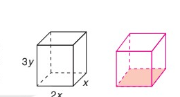

<!-- SECTION: QUICK_NOTES -->

<strong>💡 Định Nghĩa Cô Đọng:</strong> 
• <strong>Đơn thức $A$ chia hết cho đơn thức $B$:</strong> Khi mỗi biến của $B$ đều là biến của $A$ với số mũ không lớn hơn số mũ của nó trong $A$. 
• <strong>Chia đa thức cho đơn thức:</strong> Chia từng hạng tử của đa thức cho đơn thức rồi cộng các kết quả lại.

#### 📐 Công Thức Trọng Tâm:

• <strong>Chia luỹ thừa cùng cơ số:</strong>
  $$x^m : x^n = x^{m-n} \quad (m \ge n); \quad x^m : x^m = 1$$
• <strong>Chia đa thức cho đơn thức:</strong>
  $$(A + B - C) : D = (A : D) + (B : D) - (C : D)$$

<strong>⚠️ Sai Lầm Thường Gặp Cần Tránh:</strong> 
❌ <strong>Lỗi 1:</strong> Lấy số mũ chia số mũ: $x^6 : x^2 = x^3$ (SAI) ➔ Đúng phải là $x^{6-2} = x^4$. 
❌ <strong>Lỗi 2:</strong> Bỏ quên số $1$ khi chia hai biểu thức giống hệt nhau: $(2x^2 + x) : x = 2x$ (SAI) ➔ Đúng phải là $2x + 1$ vì $x : x = 1$. 
❌ <strong>Lỗi 3:</strong> Một đa thức KHÔNG chia hết cho đơn thức nếu có dù chỉ 1 hạng tử không chia hết.

<!-- SECTION: STEP_EXAMPLES -->
### 📝 Ví Dụ Mẫu Biến Đổi Từng Bước

#### 📌 Ví dụ: Thực hiện phép chia đa thức cho đơn thức
Thực hiện phép tính:
$$M = (6x^3y^2 - 9x^2y^3 + 3xy) : 3xy$$

<strong>🔍 Phương pháp tư duy:</strong> Lấy từng hạng tử của đa thức bị chia chia cho đơn thức $3xy$. Chú ý hạng tử cuối cùng $3xy : 3xy = 1$.  
<strong>📝 Lời giải chi tiết:</strong> 
• <strong>Bước 1 (Tách thành tổng các phép chia đơn thức):</strong>
  $$M = (6x^3y^2 : 3xy) + (-9x^2y^3 : 3xy) + (3xy : 3xy)$$
• <strong>Bước 2 (Thực hiện từng phép chia):</strong>
  - $6x^3y^2 : 3xy = (6:3) \cdot x^{3-1} \cdot y^{2-1} = 2x^2y$ 
  - $-9x^2y^3 : 3xy = (-9:3) \cdot x^{2-1} \cdot y^{3-1} = -3xy^2$ 
  - $3xy : 3xy = 1$ 
• <strong>Bước 3 (Cộng các kết quả lại):</strong>
  $$M = 2x^2y - 3xy^2 + 1$$
• <strong>Kết luận:</strong> Thương của phép chia là <strong>$2x^2y - 3xy^2 + 1$</strong>.

<!-- SECTION: SGK_CONTENT -->
# BÀI 5. PHÉP CHIA ĐA THỨC CHO ĐƠN THỨC

| Khái niệm, thuật ngữ | Kiến thức, kĩ năng |
|---|---|
| Đa thức $A$ chia hết cho đa thức $B$ | - Chia đơn thức cho đơn thức (trường hợp chia hết). - Chia đa thức cho đơn thức (trường hợp chia hết). |

---

## Tình huống mở đầu

Cho hai khối hộp chữ nhật: khối hộp thứ nhất có ba kích thước là $x, 2x$ và $3y$; khối hộp thứ hai có diện tích đáy là $2xy$. Tính chiều cao (cạnh bên) của khối hộp thứ hai, biết rằng hai khối hộp có cùng thể tích.

Trong bài toán này, thể tích của khối hộp thứ nhất là $V = x \cdot 2x \cdot 3y = 6x^2y$. Vì hai khối hộp có cùng thể tích nên đó cũng là thể tích của khối hộp thứ hai. Do đó, để tính chiều cao của khối hộp thứ hai, ta cần chia $6x^2y$ cho $2xy$.

Học xong bài này các em không những sẽ thực hiện được phép chia đó mà hơn nữa, còn biết cách chia một đa thức cho một đơn thức.

---

## 1. Chia đơn thức cho đơn thức

Cho hai đa thức $A$ và $B$ với $B \neq 0$ (tức là $B$ khác đa thức 0). Tương tự đối với đa thức một biến, ta nói đa thức $A$ chia hết cho đa thức $B$ nếu có đa thức $Q$ sao cho $A = B \cdot Q$.  
Khi đó ta viết $A : B = Q$, hoặc $\frac{A}{B} = Q$.  
Dưới đây, ta chỉ xét phép chia hết cho một đơn thức.

### Chia một đơn thức cho một đơn thức

**HĐ1:** Hãy nhớ lại cách chia đơn thức cho đơn thức trong trường hợp chúng có cùng một biến và hoàn thành các yêu cầu sau:  
a) Thực hiện phép chia $6x^3 : 3x^2$.  
b) Với $a, b \in \mathbb{R}$ và $b \neq 0; m, n \in \mathbb{N}$, hãy cho biết:
- Khi nào thì $ax^m$ chia hết cho $bx^n$?
- Nhắc lại cách thực hiện phép chia $ax^m$ cho $bx^n$.

**HĐ2:** Với mỗi trường hợp sau, hãy đoán xem đơn thức $A$ có chia hết cho đơn thức $B$ không; nếu chia hết, hãy tìm thương của phép chia $A$ cho $B$ và giải thích cách làm:  
a) $A = 6x^3y, B = 3x^2y$;  
b) $A = x^2y, B = xy^2$.

*(Gợi ý: Hãy lần lượt chia: hệ số cho hệ số, luỹ thừa của mỗi biến trong $A$ cho luỹ thừa của cùng biến đó trong $B$).*

Ta có kết luận sau đây:

> [!NOTE]
> a) Đơn thức $A$ chia hết cho đơn thức $B$ ($B \neq 0$) khi mỗi biến của $B$ đều là biến của $A$ với số mũ không lớn hơn số mũ của nó trong $A$.  
> b) Muốn chia đơn thức $A$ cho đơn thức $B$ (trường hợp chia hết), ta làm như sau:
> - Chia hệ số của đơn thức $A$ cho hệ số của đơn thức $B$;
> - Chia luỹ thừa của từng biến trong $A$ cho luỹ thừa của cùng biến đó trong $B$;
> - Nhân các kết quả tìm được với nhau.

**Ví dụ 1:**
Cho đơn thức $A = 5x^2yz^3$.  
a) Giải thích tại sao $A$ không chia hết cho $B = x^2y^2z^2$;  
b) Giải thích tại sao $A$ chia hết cho $C = -2x^2z^2$. Tìm thương của phép chia $A : C$.

**Giải:**  
a) Ta thấy số mũ của $y$ trong $B$ là 2, lớn hơn số mũ của $y$ trong $A$ (là 1). Do đó, $A$ không chia hết cho $B$.  
b) $A$ chia hết cho $C$ vì số mũ của các biến $x$ và $z$ trong $C$ cùng bằng 2, không lớn hơn số mũ của $x$ (bằng 2) và $z$ (bằng 3) trong $A$. Ta có:
$$A : C = 5x^2yz^3 : (-2x^2z^2) = -\frac{5}{2}yz.$$

**Luyện tập 1:**
Trong các phép chia sau đây, phép chia nào *không* là phép chia hết? Tại sao? Tìm thương của các phép chia còn lại:  
a) $-15x^2y^2$ chia cho $3x^2y$;  
b) $6xy$ chia cho $2yz$;  
c) $4xy^3$ chia cho $6xy^2$.

**Vận dụng 1:**
Giải *bài toán mở đầu*.

---

## 2. Chia đa thức cho đơn thức

### Chia một đa thức cho một đơn thức

Dưới đây là quy tắc chia một đa thức cho một đơn thức trong trường hợp mọi hạng tử của đa thức đều chia hết cho đơn thức:

> [!NOTE]
> - Đa thức $A$ chia hết cho đơn thức $B$ nếu mọi hạng tử của $A$ đều chia hết cho $B$.  
> - Muốn chia đa thức $A$ cho đơn thức $B$ (trường hợp chia hết), ta chia từng hạng tử của $A$ cho $B$ rồi cộng các kết quả với nhau.

**Ví dụ 2:**
Thực hiện phép chia: $(15x^2y^4 - 4x^3y^3 + 20x^2y) : 5x^2y$.

**Giải:**
$$\begin{aligned}
(15x^2y^4 - 4x^3y^3 + 20x^2y) : 5x^2y &= (15x^2y^4 : 5x^2y) + (-4x^3y^3 : 5x^2y) + (20x^2y : 5x^2y) \\
                                     &= 3y^3 - \frac{4}{5}xy^2 + 4.
\end{aligned}$$

**Luyện tập 2:**
Làm tính chia: $(6x^4y^3 - 8x^3y^4 + 3x^2y^2) : 2xy^2$.

**Vận dụng 2:**
Tìm đa thức $A$ sao cho $A \cdot (-3xy) = 9x^3y + 3xy^3 - 6x^2y^2$.

---

## BÀI TẬP

**1.30.**  
a) Tìm đơn thức $M$, biết rằng $\frac{7}{3}x^3y^2 : M = 7xy^2$.  
b) Tìm đơn thức $N$ sao cho $N : 0,5xy^2z = -xy$.

**1.31.** Cho đa thức $A = 9xy^4 - 12x^2y^3 + 6x^3y^2$. Với mỗi trường hợp sau đây, xét xem $A$ có chia hết cho đơn thức $B$ hay không? Thực hiện phép chia trong trường hợp $A$ chia hết cho $B$:  
a) $B = 3x^2y$;  
b) $B = -3xy^2$.

**1.32.** Thực hiện phép chia:
$$(7y^5z^2 - 14y^4z^3 + 2,1y^3z^4) : (-7y^3z^2).$$
