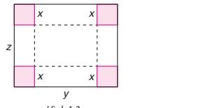

# BÀI TẬP CUỐI CHƯƠNG I

---

## A. TRẮC NGHIỆM

*Chọn phương án đúng trong mỗi câu sau:*

**1.39.** Đơn thức $-2^3x^2yz^3$ có:  
A. hệ số $-2$, bậc 8.  
B. hệ số $-2^3$, bậc 5.  
C. hệ số $-1$, bậc 9.  
D. hệ số $-2^3$, bậc 6.

**1.40.** Gọi $T$ là tổng, $H$ là hiệu của hai đa thức $3x^2y - 2xy^2 + xy$ và $-2x^2y + 3xy^2 + 1$. Khi đó:  
A. $T = x^2y - xy^2 + xy + 1$ và $H = 5x^2y - 5xy^2 + xy - 1$.  
B. $T = x^2y + xy^2 + xy + 1$ và $H = 5x^2y - 5xy^2 + xy - 1$.  
C. $T = x^2y + xy^2 + xy + 1$ và $H = 5x^2y - 5xy^2 - xy - 1$.  
D. $T = x^2y + xy^2 + xy - 1$ và $H = 5x^2y + 5xy^2 + xy - 1$.

**1.41.** Tích của hai đơn thức $6x^2yz$ và $-2y^2z^2$ là đơn thức:  
A. $4x^2y^3z^3$.  
B. $-12x^2y^3z^3$.  
C. $-12x^3y^3z^3$.  
D. $4x^3y^3z^3$.

**1.42.** Khi chia đa thức $8x^3y^2 - 6x^2y^3$ cho đơn thức $-2xy$, ta được kết quả là:  
A. $-4x^2y + 3xy^2$.  
B. $-4xy^2 + 3x^2y$.  
C. $-10x^2y + 4xy^2$.  
D. $-10x^2y + 4xy^2$.

---

## B. TỰ LUẬN

**1.43.** Một *đa thức hai biến bậc hai* thu gọn có thể có nhiều nhất:  
a) bao nhiêu hạng tử bậc hai? Cho ví dụ.  
b) bao nhiêu hạng tử bậc nhất? Cho ví dụ.  
c) bao nhiêu hạng tử khác 0? Cho ví dụ.

**1.44.** Cho biểu thức:
$$3x^3(x^5 - y^5) + y^5(3x^3 - y^3).$$
a) Rút gọn biểu thức đã cho.  
b) Tính giá trị của biểu thức đã cho nếu biết $y^4 = x^4\sqrt{3}$.

**1.45.** Rút gọn biểu thức:
$$\frac{1}{4}(2x^2 + y)(x - 2y^2) + \frac{1}{4}(2x^2 - y)(x + 2y^2).$$

**1.46.** Bạn Thành dùng một miếng bìa hình chữ nhật để làm một chiếc hộp (không nắp) bằng cách cắt bốn hình vuông cạnh $x\text{ cm}$ ở bốn góc (H.1.3) rồi gấp lại. Biết rằng miếng bìa có chiều dài là $y\text{ cm}$, chiều rộng là $z\text{ cm}$.

Tìm đa thức (ba biến $x, y, z$) biểu thị thể tích của chiếc hộp. Xác định bậc của đa thức đó.

**1.47.** Biết rằng $D$ là một đơn thức sao cho $-2x^3y^4 : D = xy^2$. Hãy tìm thương của phép chia:
$$(10x^5y^2 - 6x^3y^4 + 8x^2y^5) : D.$$

**1.48.** Làm phép chia sau theo hướng dẫn:
$$[8x^3(2x - 5)^2 - 6x^2(2x - 5)^3 + 10x(2x - 5)^2] : 2x(2x - 5)^2.$$
*Hướng dẫn:* Đặt $y = 2x - 5$.
