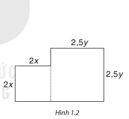

# LUYỆN TẬP CHUNG (Trang 17)

## Ví dụ minh họa

Cho hai đa thức:
$$A = 5x^2 - 2x^3y + 7x^3y^2 - 118; \quad B = -7x^3y^2 + x^3y - 5xy^2 - 4x^2 + y.$$

a) Liệt kê các hạng tử của đa thức $A$, trong đó hạng tử nào có bậc cao nhất?  
b) Tìm tổng $A + B$ và xác định bậc của đa thức $A + B$;  
c) Tìm hiệu $A - B$ và tính giá trị của hiệu tại $x = 1$ và $y = -2$.

**Giải:**

a) Đa thức $A$ có bốn hạng tử là $5x^2, -2x^3y, 7x^3y^2, -118$.  
Hạng tử có bậc cao nhất trong $A$ là $7x^3y^2$.

b) Ta có:
$$\begin{aligned}
A + B &= (5x^2 - 2x^3y + 7x^3y^2 - 118) + (-7x^3y^2 + x^3y - 5xy^2 - 4x^2 + y) \\
      &= (5x^2 - 4x^2) + (-2x^3y + x^3y) + (7x^3y^2 - 7x^3y^2) - 118 - 5xy^2 + y \\
      &= x^2 - x^3y - 5xy^2 + y - 118.
\end{aligned}$$
Hạng tử có bậc cao nhất của $A + B$ là $-x^3y$ có bậc bốn, vậy đa thức $A + B$ là đa thức bậc bốn.

c) Ta có:
$$\begin{aligned}
A - B &= (5x^2 - 2x^3y + 7x^3y^2 - 118) - (-7x^3y^2 + x^3y - 5xy^2 - 4x^2 + y) \\
      &= 5x^2 - 2x^3y + 7x^3y^2 - 118 + 7x^3y^2 - x^3y + 5xy^2 + 4x^2 - y \\
      &= (5x^2 + 4x^2) + (-2x^3y - x^3y) + (7x^3y^2 + 7x^3y^2) - 118 + 5xy^2 - y \\
      &= 9x^2 - 3x^3y + 14x^3y^2 + 5xy^2 - y - 118.
\end{aligned}$$

Tại $x = 1$ và $y = -2$, đa thức $A - B$ có giá trị bằng:
$$9 \cdot 1^2 - 3 \cdot 1^3 \cdot (-2) + 14 \cdot 1^3 \cdot (-2)^2 + 5 \cdot 1 \cdot (-2)^2 - (-2) - 118 = 9 + 6 + 56 + 20 + 2 - 118 = -25.$$

---

## BÀI TẬP

**1.18.** Cho các biểu thức:
$$\frac{4}{5}x;\quad (\sqrt{2}-1)xy;\quad -3xy^2;\quad \frac{1}{2}x^2y;\quad \frac{1}{x}y^3;\quad -xy + \sqrt{2};\quad -\frac{3}{2}x^2y;\quad \frac{\sqrt{x}}{5}.$$

a) Trong các biểu thức đã cho, biểu thức nào là đơn thức? Biểu thức nào không là đơn thức?  
b) Hãy chỉ ra hệ số và phần biến của mỗi đơn thức đã cho.  
c) Viết tổng tất cả các đơn thức trên để được một đa thức. Xác định bậc của đa thức đó.

**1.19.** Trong một khách sạn có hai bể bơi dạng hình hộp chữ nhật. Bể thứ nhất có chiều sâu là $1,2\text{ m}$, đáy là hình chữ nhật có chiều dài $x\text{ mét}$, chiều rộng $y\text{ mét}$. Bể thứ hai có chiều sâu là $1,5\text{ m}$, hai kích thước đáy gấp 5 lần hai kích thước đáy của bể thứ nhất.  
a) Hãy tìm đơn thức (hai biến $x$ và $y$) biểu thị số mét khối nước cần có để bơm đầy cả hai bể bơi.  
b) Tính lượng nước bơm đầy hai bể nếu $x = 5\text{ m}, y = 3\text{ m}$.

**1.20.** Tìm bậc của mỗi đa thức sau rồi tính giá trị của chúng tại $x = 1; y = -2$:
$$P = 5x^4 - 3x^3y + 2xy^3 - x^3y + 2y^4 - 7x^2y^2 - 2xy^3;$$
$$Q = x^3 + x^2y + xy^2 - x^2y - xy^2 - x^3.$$

**1.21.** Cho hai đa thức:
$$A = 7xyz^2 - 5xy^2z + 3x^2yz - xyz + 1; \quad B = 7x^2yz - 5xy^2z + 3xyz^2 - 2.$$

a) Tìm đa thức $C$ sao cho $A - C = B$;  
b) Tìm đa thức $D$ sao cho $A + D = B$;  
c) Tìm đa thức $E$ sao cho $E - A = B$.

**1.22.** Từ một miếng bìa, người ta cắt ra hai hình tròn có bán kính $x\text{ centimét}$ và $y\text{ centimét}$. Tìm biểu thức biểu thị diện tích phần còn lại của miếng bìa, nếu biết miếng bìa có hình dạng gồm hai hình vuông ghép lại và có kích thước (centimét) như Hình 1.2. Biểu thức đó có phải là một đa thức không? Nếu phải thì đó là đa thức bậc mấy?

**1.23.** Cho ba đa thức:
$$M = 3x^3 - 4x^2y + 3x - y; \quad N = 5xy - 3x + 2; \quad P = 3x^3 + 2x^2y + 7x - 1.$$

Tính $M + N - P$ và $M - N - P$.
